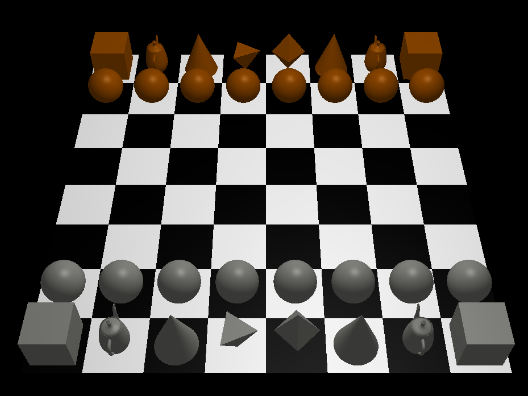

# OpenGL Simple Chessboard GUI 

This repository contains a simple user interface for a chess game developed using OpenGL. Different pieces are represented by different built-in shapes in OpenGL. 



Viewpoint and lighting can be adjusted based on the following commands: 

`r` : Rotate the board

`u` : Move the viewpoint up.

`d` : Move the viewpoint down.

`0` and `1` : Control lighting

`k` or `p` : Move a knight or pawn randomly

To compile and run on Linux (ensure OpenGL and GLUT are installed): 
```
g++ chess_gui.cpp -lGL -lGLU -lglut
./a.out
```